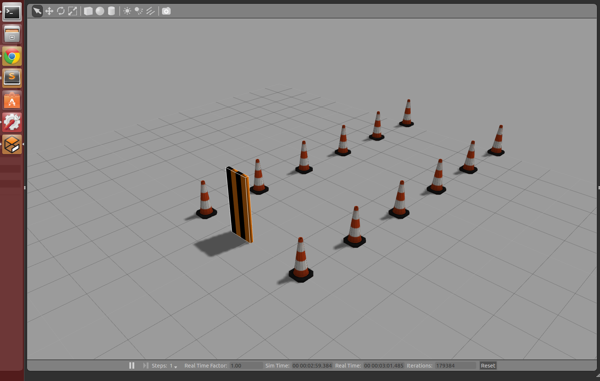
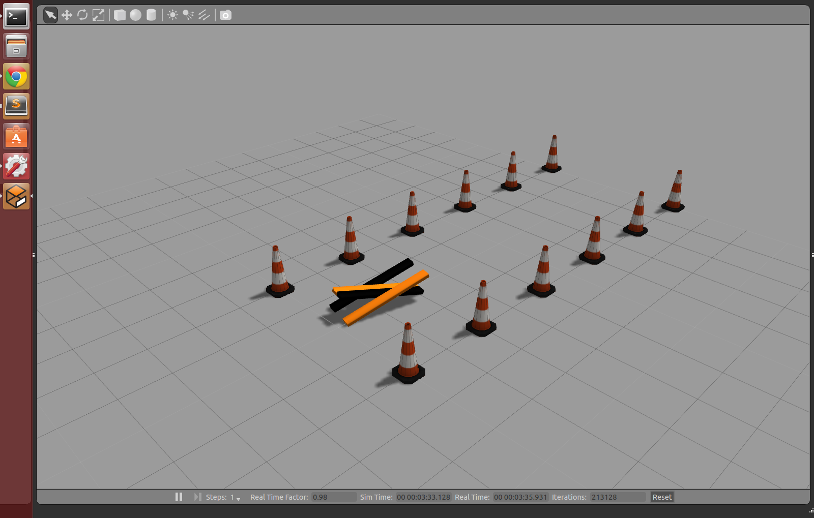
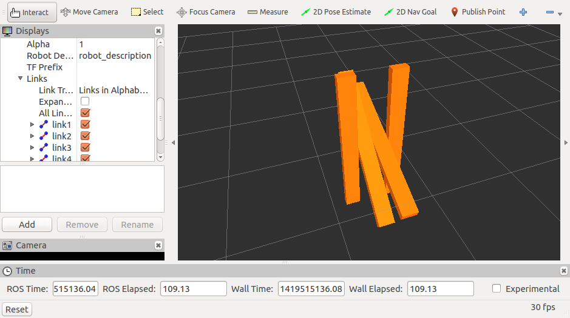

Main

# TARS Robot

This is an experimental project to simulate and teach a robot control dynamics. The robot of choice is a simple model of the [TARS](docs/TARS.md) robot seen in Interstellar.

## Goal

The goal of this project is to teach the TARS robot to move forward in the simulated environment without moving any cones.

An example python control program can be found in the tars_sample_controller package. It demonstrates the ability to control the TARS robot while it is in a physical simulation:

The TARS robot is currently very simplified. It has 3 joints and 4 legs all acuated around the center.

## Project Overview

Currently the project makes use of [ROS](http://www.ros.org/) and [Gazebo](http://gazebosim.org/) for controlling and simulating the robot respectively.

### Components
+ **tars_robot** - Packages used for robot description and simulation
	+ [**tars_control_lib**](tars_robot/tars_control_lib/README.md) - C++ shared library that abstracts control of the TARS simulated robot 
	+ [**tars_control_lib_py**](tars_robot/tars_control_lib_py/README.md) - Python package that abstracts control of the TARS simulated robot 
	+ **tars_control** - Package used to set up robot controller topics for joints
	+ **tars_description** - Package used for describing TARS robot model
	+ **tars_gazebo** - Package used for setting up gazebo simulation environment with TARS robot
+ **tars_controller_samples** - Example TARS controllers
	+ [**tars_sample_controller_cpp**](tars_controller_samples/tars_sample_controller_cpp/README.md) - C++ shared library that abstracts control of the TARS simulated robot 
	+ [**tars_sample_controller_py**](tars_controller_samples/tars_sample_controller_py/README.md) - Python shared package that abstracts control of the TARS simulated robot 

### Roadmap

+ Create framework for spawning, running, and resetting robots
+ Make single random NN for robot control
+ Implement NEAT evolutionary algorithm for training
+ Implement database to store NEAT results

## Setup

**This is currently only tested and running on Ubuntu 14.04**

### Installation
Dependencies:
+ [Install ROS](http://wiki.ros.org/indigo/Installation/Ubuntu)
+ [Install ROS Controller](http://wiki.ros.org/ros_control) - See bottom of wiki page
+ Check this directory out into your catkin workspace `src/` folder
+ Make your catkin workspace - `catkin_make; catkin_make install`

This project will compile packages as normal under ROS catkin make.

### To Run

To open Gazebo and begin a simulation run:

	roslaunch tars_sample_controller tars_runner.launch

You may also open Gazebo independently and then run the control script to repeatedly run trials. Run each of these in a separate terminal window:
	
	roslaunch tars_gazebo tars_world.launch
	rosrun tars_sample_controller tars_sample_controller.py

## Reference Material

Some articles and material that has been helpful:

#### ROS
+ [Tutorial: Using a URDF in Gazebo](http://gazebosim.org/tutorials?tut=ros_urdf)
+ [Tutorial: ROS Control](http://gazebosim.org/tutorials?tut=ros_control)
+ [Package: gazebo](http://wiki.ros.org/gazebo)
+ [Building Modular ROS Packages](http://jbohren.com/articles/modular-ros-packages/)

#### ML
+ [Competitive Coevolution through Evolutionary Complexification](https://www.jair.org/media/1338/live-1338-2278-jair.pdf) - Details on NEAT algorithm
+ [Flexible Muscle-Based Locomotion for Bipedal Creatures](http://www.cs.ubc.ca/~van/papers/2013-TOG-MuscleBasedBipeds/2013-TOG-MuscleBasedBipeds.pdf) - Interesting take on training gait

## Thanks!

Thanks for looking and please feel free to contact if you would like to help in any way. From 3D modelling to programming to AI to robot building - all is welcomed.
